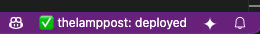

# Netlify Status - VS Code Extension

A VS Code extension that displays real-time Netlify deployment status in your status bar.

## Features

- 🟢 Real-time deployment status in status bar
- 🔄 Automatic refresh every 10 seconds (configurable, 5s during builds)
- 🎯 Click to open Netlify dashboard
- ⚙️ Simple configuration via Command Palette
- 📊 Hover for detailed deployment information
- 🎨 Visual progress bars during builds
- 🚀 Smart polling - faster updates during active deployments

## Quick Start

1. Install the extension
2. Open Command Palette (`Cmd+Shift+P` / `Ctrl+Shift+P`)
3. Run `Netlify: Configure Netlify`
4. Follow the 3-step guided setup:
   - **Step 1**: Enter your Netlify Personal Access Token
   - **Step 2**: Select your site from the auto-loaded list
   - **Step 3**: Customize display options
5. Status will appear in the status bar!

## Getting Your Netlify Credentials

### Personal Access Token
1. Go to [Netlify User Settings](https://app.netlify.com/user/applications)
2. Click "New access token"
3. Give it a name and create
4. Copy the token

### Site Selection
No need to manually find your Site ID! The extension automatically loads all your sites and lets you choose from a visual list.

## Status Indicators

The extension shows different states with visual indicators in your VS Code status bar:

### ✅ Deployed State


When your site is successfully deployed, you'll see:
- `✅ my-site: deployed (2m 15s)` - Shows deploy time
- Green checkmark indicates successful deployment
- Hover shows detailed deployment information

### 🔨 Building State


During builds, you'll see:
- `🔨 my-site: building [████████░░] 2m 15s` - Progress bar with timer
- Real-time progress indication
- Faster 5-second polling during builds

### 🚀 Uploading/Processing State


When processing deployment:
- `🚀 my-site: deploying [██████████] 45s` - Final deployment stage
- Rocket icon indicates deployment in progress

### Other States
- ❌ **Failed**: `❌ my-site: failed after 3m 12s` - Shows failure time
- ⚪ **Other**: Ready/idle states
- ⚠️ **Warning**: Connection or auth issues

## Development

To run locally:

```bash
npm install
npm run compile
```

Then press `F5` to open a new VS Code window with the extension loaded.

### Version Management

Use the built-in version bump tool to keep package.json and git tags in sync:

```bash
# Increment patch version (1.0.0 → 1.0.1)
npm run bump:patch

# Increment minor version (1.0.0 → 1.1.0)
npm run bump:minor

# Increment major version (1.0.0 → 2.0.0)
npm run bump:major

# Set specific version
npm run bump 2.5.0

# Automatically push changes and tag to remote
npm run bump:patch -- --push
```

The version bump tool will:
1. Update the version in `package.json`
2. Commit the change with a descriptive message
3. Create a matching git tag (e.g., `v1.0.1`)
4. Optionally push to remote (with `--push` flag)

When you push a version tag, GitHub Actions will automatically publish the extension to the VS Code Marketplace.

## Configuration

### Easy Configuration Panel
Use `Netlify: Configure Netlify` command for a guided setup experience:
- **Persistent window**: Stays open while you get your token from Netlify
- **Auto-loads sites**: No need to manually find Site IDs
- **Visual site selection**: Shows site name, URL, and status
- **Smart reconfiguration**: Remembers your current site for quick setting changes

### Available Settings
- `netlify-status.apiToken`: Your Netlify API token
- `netlify-status.siteId`: Site ID to monitor (auto-selected via UI)
- `netlify-status.siteName`: Display name for the site
- `netlify-status.refreshInterval`: Refresh interval in seconds (default: 10, 5s during builds)
- `netlify-status.showSiteName`: Show site name in status bar (default: true)
- `netlify-status.showDeployTime`: Show deployment duration (default: true)
- `netlify-status.showProgressBar`: Show progress bar during builds (default: true)

### Quick Commands
- `Netlify: Configure Netlify` - Open configuration panel
- `Netlify: Refresh Status` - Manually refresh deployment status
- `Netlify: Open Dashboard` - Open your site's Netlify dashboard
- `Netlify: Reset Configuration` - Clear all settings and start over

## Display Examples

**Full Display**:
- `🔨 my-site: building [████████░░] 2m 15s`
- `✅ my-site: deployed (1m 30s)`

**Customizable Options**:
- **Site name display**: `🔨 Netlify: building` vs `🔨 my-site: building`
- **Deployment time**: `✅ my-site: deployed` vs `✅ my-site: deployed (1m 30s)`
- **Progress bars**: `🔨 my-site: building 2m 15s` vs `🔨 my-site: building [████████░░] 2m 15s`

## User Experience Features

### First-Time Setup
1. **Guided 3-step process** with clear instructions
2. **Persistent configuration window** - won't close when you switch to get your token
3. **Automatic site discovery** - loads all your Netlify sites
4. **Visual site selection** with deployment status and last update info

### Ongoing Usage
1. **Smart reconfiguration** - shows current site info without requiring reload
2. **One-click changes** - modify display settings instantly
3. **Quick access commands** - refresh, open dashboard, or reset from Command Palette
4. **Real-time updates** - status bar refreshes automatically every 10 seconds
5. **Intelligent polling** - faster 5-second updates during active deployments

## API Integration

This extension uses the official Netlify REST API v1:
- **Deployment Status**: `GET /api/v1/sites/{site_id}/deploys` - Gets latest deployment info
- **Site Information**: `GET /api/v1/sites/{site_id}` - Gets site details
- **Authentication**: Bearer token authentication
- **Rate Limiting**: Smart polling with configurable intervals
- **Error Handling**: Comprehensive error handling for network issues, auth errors, and API limits

## Privacy & Security

- **Token Storage**: API tokens are stored securely in VS Code's settings
- **No Data Collection**: Extension doesn't collect or transmit any personal data
- **Local Processing**: All status processing happens locally in your VS Code instance
- **Official API**: Uses only official Netlify API endpoints